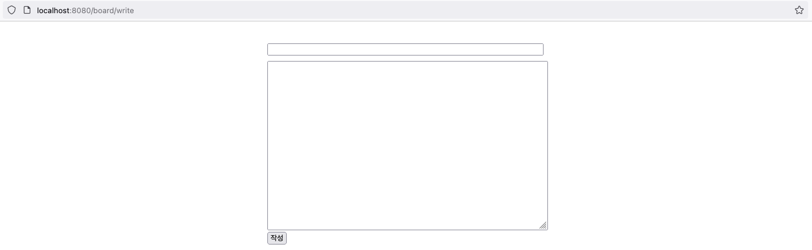
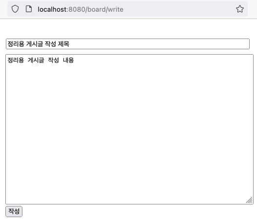
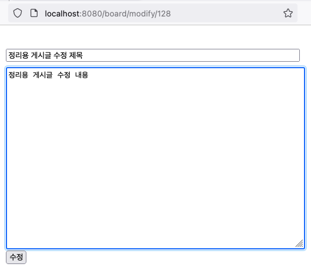
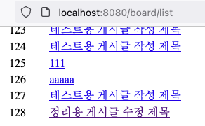
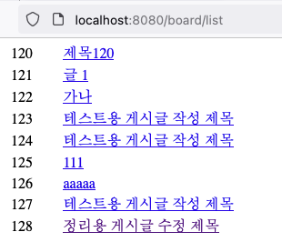
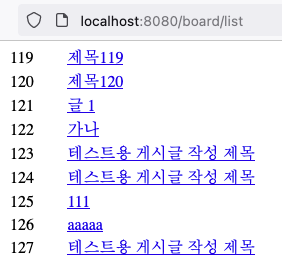

# 1. 개요
프로젝트 명: CRUD Service  
개발 인원: 1명  
기간: 2023.11.20 ~ 2023.11.20  
주요 기능: 기본적인 게시판 기능(Create, Read, Update, Delete)  
기술: Java, SpringBoot, thymeleaf, Gradle  
DB: MariaDB
Packaging: Jar
Dependencies: Spring Web, JPA, MariaDB Driver, Thymeleaf, Lombok

 

# 2. 개발도구
개발 언어: JAVA  
프레임 워크: Spring Boot  
통합 개발 환경(IDE): IntelliJ(Community version)  
DB: MariaDB  
View template: Thymeleaf  
DB 접근 기술 JPA  

 

# 3. CREATE
글 작성 페이지  

 

# 4. 내용 입력  

 

# 5. 입력 내용 확인  

 

# 6. 글 수정 페이지  

 

# 7. 글 수정 확인  

 

# 8. 글 수정 상세 내용  

 

# 9. 글 삭제 전  

 

# 10. 글 삭제 후  

